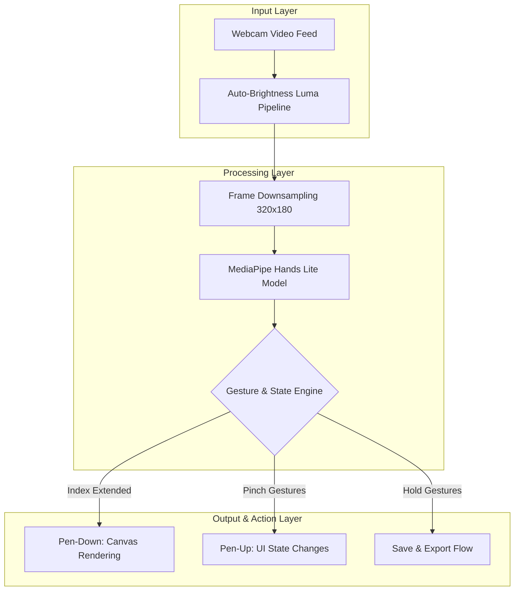

# KINESIS Air Canvas

KINESIS is an advanced spatial computing application that enables users to draw in the air using intuitive hand gestures. By leveraging MediaPipe hand tracking, it transforms a standard webcam into a high-precision, hands-free input device for digital art and interaction.

Moving beyond traditional browser-based air canvases, KINESIS eliminates the need for keyboard modifiers. It introduces complex multi-finger gesture recognition, dynamic color palettes, and automated environmental adjustments to deliver a seamless user experience.

## System Architecture

The KINESIS engine processes webcam input through a highly optimized pipeline to ensure low latency and high tracking accuracy.



## Core Features

- **Pen-Down Menu Lock**: Prevents accidental UI interactions while drawing. Menu controls are only registered when the index finger is curled.
- **Pinch Controls**: Cycle through colors or brush sizes by pinching the thumb against the middle, ring, or pinky fingers.
- **Custom HSL Palette**: Features 6 editable color slots managed via an interactive HSL color wheel interface.
- **Auto-Brightness Engine**: Real-time luma sampling dynamically adjusts webcam gain, ensuring consistent tracking across varying lighting conditions.
- **Sequential Save Flow**: Securely export artwork as a PNG file by holding a peace sign for 5 seconds, followed by a thumbs-up for 3 seconds.
- **Keyboard Shortcuts**: Retains standard bindings like `Ctrl+Z` for undo and `Spacebar` to clear the canvas for rapid workflows.

## Gesture Matrix

| Gesture | Application Action |
| :--- | :--- |
| 1 Finger (Index Extended) | Draw + Menu Lock Active |
| Thumb + Middle Finger | Select Next Color |
| Thumb + Ring Finger | Select Previous Color |
| Thumb + Pinky Finger | Cycle Brush Size |
| 2 Fingers | Pen Lift / Hover State |
| Peace Sign (Hold 5s) | Trigger Save Prompt |
| Thumbs Up (Hold 3s) | Confirm Save / Export PNG |
| Thumbs Down | Cancel Save Operation |
| Fist | Standby Mode |
| `Ctrl + Z` | Undo Last Stroke |
| `Spacebar` | Clear Canvas |

## Setup and Execution

KINESIS is built with pure Vanilla JavaScript, HTML, and CSS, requiring no build steps or external frameworks. Because modern browsers restrict webcam access on local file paths, the application must be served via a local web server.

**Local Execution Steps:**

1. Clone the repository or download the source files.
2. Open a terminal and navigate to the project directory.
3. Start a local HTTP server using Python:
   ```bash
   python3 -m http.server 8000
   ```
4. Open a web browser and navigate to `http://localhost:8000`.
5. Grant the necessary webcam permissions when prompted by the browser.

## Technology Stack

- **MediaPipe Hands**: High-fidelity 3D hand landmark detection.
- **Canvas 2D API**: High-performance drawing and rendering engine.
- **Web Audio API**: Subtle audio feedback for gesture confirmations and state transitions.
- **Vanilla JS / HTML**: Zero dependencies, lightweight, and build-tool-free architecture.

## Credits and Origins

KINESIS represents a significant technical evolution based on the foundational air canvas concepts demonstrated in the ConOps repository. The original hand-tracking web implementation provided the baseline inspiration for this project. We have extensively improved the gesture logic, removed keyboard dependencies, optimized rendering performance, and introduced advanced features such as the auto-brightness pipeline and multi-stage save flows.

- Original baseline code and concept: [sucsarge/ConOps (index.html)](https://github.com/sucsarge/ConOps/blob/main/index.html)
